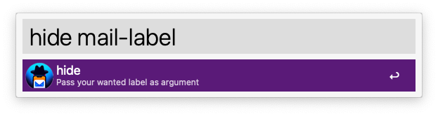
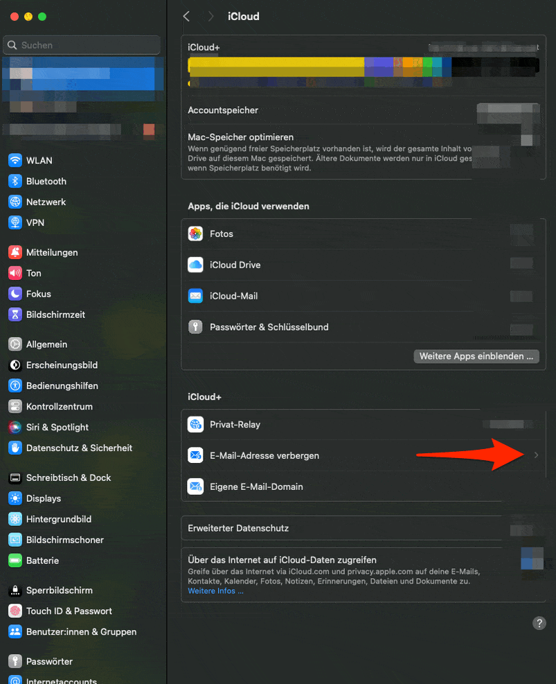

# alfred-hide-my-mail


<p align="center">
  
</p>

### 🎩 Create a new iCloud Hide My Mail address automatically with an specified label via Alfred and have it copied to your clipboard.

## Showcase
> The whole shown process is completed within a couple seconds.
<p align="center">
  
  
</p>


## Installation
1. Download the latest `.alfredworkflow` file from the [releases page](https://github.com/Klizzy/alfred-hide-my-mail/releases).
2. Double-click the downloaded file to import it into Alfred 5.

## Usage
1. Open Alfred (default shortcut: `Option + Space`).
2. Type `hide` followed by the label you want to assign to the new iCloud Hide My Mail address.
3. Press `Enter`.
4. Press `CMD + V` to paste the generated iCloud Hide My Mail address.

The workflow will open the MacOS System Settings, navigate to the appropriate section, create a new iCloud Hide My Mail address with the specified label and adds the generate mail to your clipboard.

## Requirements

1. Alfred 5.1 or later
2. Active [iCloud+](https://support.apple.com/guide/icloud/mm9d9012c9e8/icloud) subscription
3. **Accessibility permission for Alfred**: System Settings → Privacy & Security → Accessibility → enable Alfred. macOS does not always prompt for this.
4. macOS:

| macOS | Status |
|-------|--------|
| Sequoia 15.x | ✅ Tested by the maintainer |
| Tahoe 26.x | ✅ Based on community-verified fixes — please report issues with `hide-diagnose` |
| Sonoma 14.x | ❌ Not supported by v2.0 — use [release v.1.2](https://github.com/Klizzy/alfred-hide-my-mail/releases/tag/v.1.2) or [release v.1.0](https://github.com/Klizzy/alfred-hide-my-mail/releases/tag/v.1.0) |

The workflow detects your macOS version and uses the matching navigation path. Button labels are recognised in English, German, French and Spanish.

## Configuration

You can change the keyword to trigger the workflow by opening the Alfred Preferences, navigating to the `Workflows` tab, selecting the `Hide My Mail` workflow, and clicking on the `Configure Workflow` button. Here you can change the keyword to your desired value.
- The default keyword is `hide`.

## Diagnostics

The notification always tells you what really happened: `Created <address> — copied to your clipboard`, or `Failed: <step> …`.

**When it fails, a diagnosis file is written automatically** to `~/Desktop/hide-my-mail-diagnosis.txt` with the System Settings layout at the moment of failure. Attach it to a [GitHub issue](https://github.com/Klizzy/alfred-hide-my-mail/issues). It contains UI structure and your macOS/locale/Alfred versions, no addresses or personal data beyond what is visible in that System Settings pane — check it before posting.

You can also produce it on demand: run `hide-diagnose` in Alfred (no argument). That opens System Settings, navigates to Hide My Email without creating anything, and writes the same file.

## Why?

On some websites you don't get the native icloud+ hide my mail prompt for the email field, so it has to be created manually.
The complete process is automated with this workflow, so you don't have to click 8-10 times through the system settings to get your generated mail.

## Troubleshooting

**"Failed: Timeout waiting for …" right at the first step / System Settings just opens.** Almost always missing Accessibility permission for Alfred (see Requirements). If Alfred is already listed, remove and re-add it, or run `tccutil reset Accessibility com.runningwithcrayons.Alfred` in Terminal and trigger the workflow again.

**Works in Terminal but not from Alfred (or vice versa).** Accessibility permission is per app. Grant it to Alfred *and* to your terminal app if you use both.

**"Failed: … the flow finished but the clipboard did not change".** The clicks went through but nothing was copied — usually a UI layout change in a new macOS release. Attach the diagnosis file to an issue.

**A leftover System Settings window from a previous run.** The workflow closes System Settings before it starts and after it finishes, including on failure.

## Building and testing from source

```sh
./package.sh          # writes HideMyMail.alfredworkflow (double-click to import into Alfred)
bash tests/headless.sh   # lint, compile, self-tests, info.plist structure, bundle contents — also runs in CI
bash tests/live.sh       # maintainer smoke test: creates ONE real address and checks the clipboard
```

`tests/headless.sh` needs `python3` (Xcode Command Line Tools). The GUI flow itself cannot run in CI (no iCloud account, no Accessibility), so every release is verified by hand on Sequoia and by testers on Tahoe.

## Contact & Support

- [Code & Support](https://github.com/Klizzy/alfred-hide-my-mail)
- [LinkedIn](https://www.linkedin.com/in/steven-zemelka-82807b279/)

## Credits

The main script is heavily inspired by a created Shortcut from [this reddit thread](https://www.reddit.com/r/shortcuts/comments/yp5817/comment/je8o0or/).

Thanks to [@coryfklein](https://github.com/coryfklein) and [@JosefGvirt](https://github.com/JosefGvirt) for the macOS Tahoe pull requests with working examples — they made Tahoe support possible while I could not yet upgrade and test it myself.
